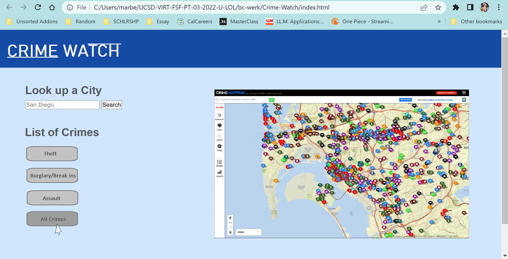
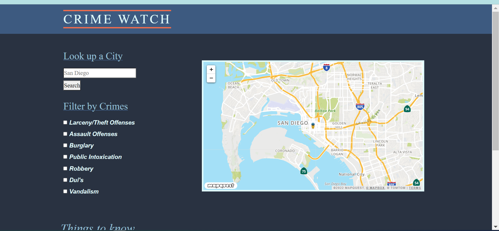

# Crime-Watch

Crime watch is a website designed for users who are looking to move into a new home and want to be aware of the level of safety in their perspective buying options. With just a city name and a specific list of crimes to chose from, a user can research different potential locations and assess for themselves if they are in fact interested in moving into that neighborhood or not. By focusing on key crimes that would  directly affect the quality of living as well as the price.

[This is a link to the website itself:](https://ElliottLi97.github.io/Crime-Watch/)

## Presentation & Layout

With a straightforward design a user can visit the website and in an instant recognize it's purpose and function. We decided to keep the map the main focus of the page with the search bar being a larger more visible size than in other instances where search bars are a small side feature.
Blue is said to be representative of calmness and reliability which is why we layered shades of it on the page. Those were the feelings we wanted to inspire in users when looking through our page as opposed to the more common stressful and often times scary feelings when looking up this information.

## Function 

Explaining how the website functions, what happens behind the scenes when you click on search and specific crimes! 

## API Links

[Mapquest API link](https://developer.mapquest.com/documentation)
[Leaflet API link](https://leafletjs.com/reference.html)

[Crimeometer api link](https://www.crimeometer.com/pricing)